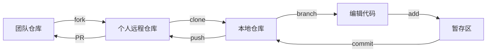

# 第一课总结

## 工作流

```mermaid
graph LR
A[团队仓库] --->|fork| B[个人远程仓库]
B[个人远程仓库] --->|clone| C[本地仓库]
C[本地仓库] --->|branch| D[编辑代码]
D[编辑代码] --->|add| E[暂存区]
E[暂存区] --->|commit| C[本地仓库]
C[本地仓库] --->|push| B[个人远程仓库]
B[个人远程仓库] --->|PR| A[团队仓库]
```
