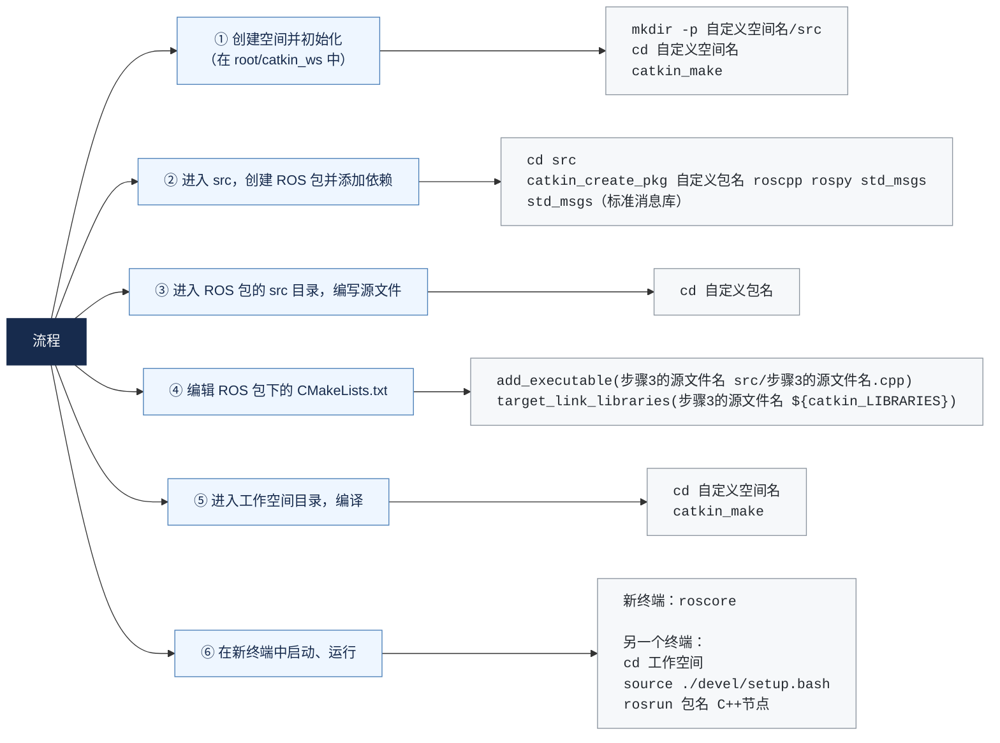

# ROS

**ROS（大脑）→ STM32/...（小脑）→ 硬件**

- ROS 是一套通用软件框架，可提升复用性。
- ROS 集成了大量工具、库、协议，简化对机器人的控制。

**ROS = 通信 + 工具 + 功能 + 生态**

## 实现流程

```mermaid
%%{init: {"flowchart": {"wrappingWidth": 1000}}}%%
flowchart LR
    FLOW["流程"]

    S1["① 创建空间并初始化<br/>（在 root/catkin_ws 中）"]
    C1["mkdir -p 自定义空间名/src<br/>cd 自定义空间名<br/>catkin_make"]

    S2["② 进入 src，创建 ROS 包并添加依赖"]
    C2["cd src<br/>catkin_create_pkg 自定义包名 roscpp rospy std_msgs<br/>std_msgs（标准消息库）"]

    S3["③ 进入 ROS 包的 src 目录，编写源文件"]
    C3["cd 自定义包名"]

    S4["④ 编辑 ROS 包下的 CMakeLists.txt"]
    C4["add_executable(步骤3的源文件名 src/步骤3的源文件名.cpp)<br/>target_link_libraries(步骤3的源文件名 ${catkin_LIBRARIES})"]

    S5["⑤ 进入工作空间目录，编译"]
    C5["cd 自定义空间名<br/>catkin_make"]

    S6["⑥ 在新终端中启动、运行"]
    C6["新终端：roscore<br/><br/>另一个终端：<br/>cd 工作空间<br/>source ./devel/setup.bash<br/>rosrun 包名 C++节点"]

    FLOW --> S1
    FLOW --> S2
    FLOW --> S3
    FLOW --> S4
    FLOW --> S5
    FLOW --> S6

    S1 --> C1
    S2 --> C2
    S3 --> C3
    S4 --> C4
    S5 --> C5
    S6 --> C6

    classDef root fill:#172b4d,stroke:#172b4d,color:#ffffff
    classDef step fill:#eef6ff,stroke:#4b7fb8,color:#172b4d
    classDef command fill:#f6f8fa,stroke:#8c959f,color:#24292f,font-family:monospace,text-align:left,white-space:nowrap
    class FLOW root
    class S1,S2,S3,S4,S5,S6 step
    class C1,C2,C3,C4,C5,C6 command
```
